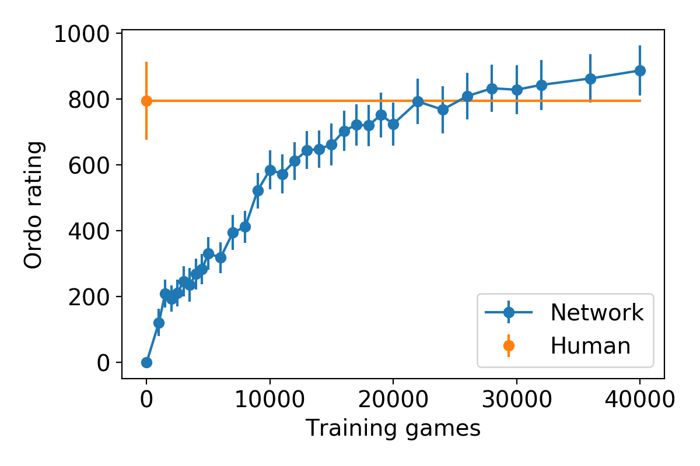

## Selfplay reinforcement learning neural network   for playing Ultimate Tic-Tac-Toe (UTTT)

Run `gui.py` to play against a neural network.

## Rules:
* The game board consists of a 3x3 grid of 9 mini-boards, each having 3x3 tiles.
* Player X begins by playing in any tile. Play then alternates between players O and X.
* **Players must play in the mini-board corresponding to the location of the previous move in its mini-board.** For example, if the previous move was an X in the upper-right corner of the lower-right miniboard, then player O must play in the upper-right *miniboard*.
* A mini-board is finished when it is won by a player (3 in a row) or all tiles are taken (tie). A player can play in any mini-board if the one pointed to is finished.
* The game is won when a player wins the big board (3 mini-boards in a row). Tied mini-boards do not count for either player. The game is tied when neither player can win the big board.

## Selfplay strength estimates

